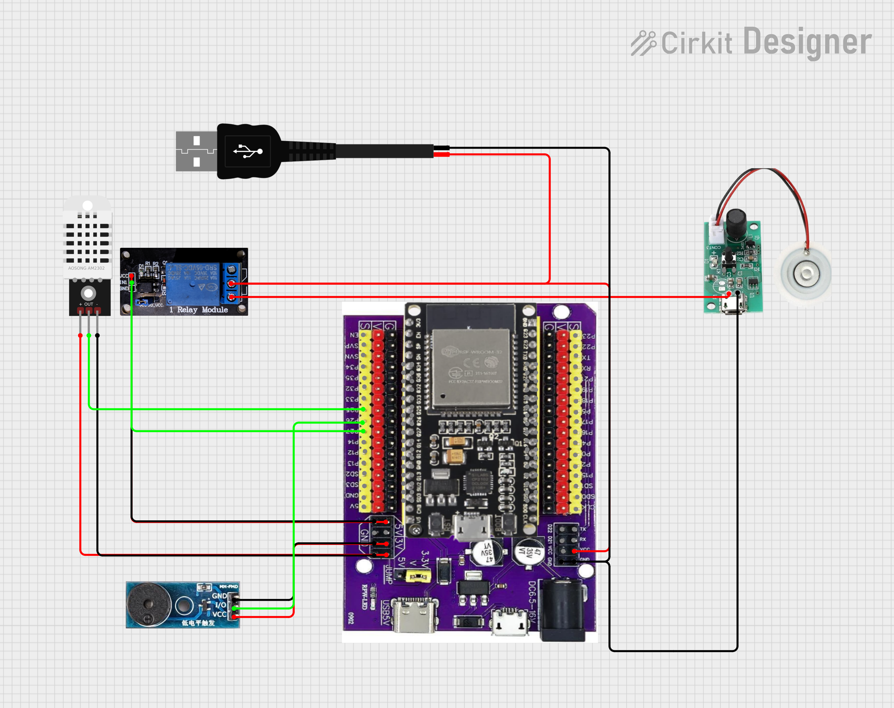
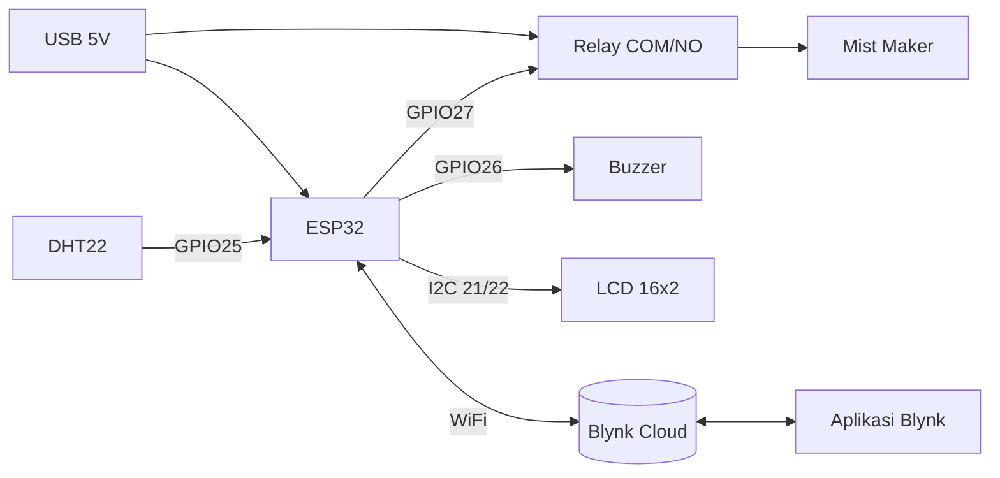

# 🍄 MycoGrow IoT

Sistem monitoring dan kontrol otomatis **suhu & kelembapan** berbasis **ESP32** untuk budidaya jamur (kumbung). Data sensor dikirim ke aplikasi **Blynk** secara real-time, dan **mist maker (humidifier ultrasonik)** dinyalakan otomatis lewat relay ketika kondisi ruangan keluar dari rentang ideal. Pengguna juga dapat mengontrol perangkat secara manual dari smartphone.

---

## ✨ Fitur

- 🌡️ Pembacaan suhu & kelembapan real-time dengan sensor **DHT22 (AOSONG AM2302)**
- 📟 Tampilan data langsung di **LCD I2C 16x2**
- 📱 Monitoring & kontrol jarak jauh via **Blynk IoT** (WiFi)
- 💨 **Mode otomatis**: mist maker menyala bila suhu > 30 °C atau kelembapan < 90 %
- 🕹️ **Mode manual**: nyalakan/matikan mist maker dari aplikasi
- 🔔 **Buzzer** sebagai indikator suara saat mist maker aktif

---

## 🧩 Komponen

| Komponen | Jumlah | Fungsi |
|---|---|---|
| ESP32 DevKit (board `esp32doit-devkit-v1`) + expansion board | 1 | Mikrokontroler utama + WiFi |
| Sensor DHT22 / AM2302 | 1 | Sensor suhu & kelembapan |
| Modul relay 1 channel (aktif LOW) | 1 | Saklar daya mist maker |
| Modul mist maker ultrasonik (input micro-USB 5 V) | 1 | Penghasil kabut / pelembap |
| Modul buzzer (trigger level rendah) | 1 | Indikator suara |
| LCD 16x2 I2C (alamat `0x27`) | 1 | Tampilan lokal |
| Kabel USB 5 V (sumber daya) | 1 | Catu daya sistem |

---

## 🔌 Skema Rangkaian



> Dibuat dengan [Cirkit Designer](https://www.cirkitstudio.com/).

### Pemetaan Pin

| Perangkat | Pin perangkat | Pin ESP32 |
|---|---|---|
| DHT22 | OUT (data) | GPIO 25 |
| Buzzer | I/O | GPIO 26 |
| Relay | IN1 | GPIO 27 |
| LCD I2C | SDA | GPIO 21 |
| LCD I2C | SCL | GPIO 22 |
| Semua modul | VCC / GND | 5 V / 3V3 dan GND sesuai spesifikasi modul |

### Jalur Daya Mist Maker

Daya 5 V dari kabel USB **tidak langsung** masuk ke mist maker. Kabel positif (merah) melewati terminal **COM–NO relay** sebelum menuju input micro-USB mist maker, sehingga relay bertindak sebagai saklar. Jalur GND dihubungkan bersama (common ground) dengan ESP32.



---

## ⚙️ Cara Kerja

1. ESP32 terhubung ke WiFi, lalu ke Blynk Cloud.
2. Setiap **2 detik**, ESP32 membaca suhu & kelembapan dari DHT22, mengirimkannya ke Blynk (V1, V2), dan menampilkannya di LCD.
3. Pada **mode otomatis**, relay (dan buzzer) aktif jika:

   ```
   suhu > 30 °C   ATAU   kelembapan < 90 %
   ```

   Jika tidak, relay dimatikan.
4. Pada **mode manual** (V3 = ON), logika otomatis dinonaktifkan dan relay dikendalikan sepenuhnya dari tombol di aplikasi (V0).

> Relay bersifat **aktif LOW**: pin `LOW` = relay menyala, `HIGH` = relay mati.

---

## 📱 Konfigurasi Blynk

Buat template dengan nama **MycoGrow**, lalu tambahkan *datastream* berikut:

| Virtual Pin | Nama | Tipe | Arah | Fungsi |
|---|---|---|---|---|
| V0 | Relay Manual | Integer (0/1) | App → Device | Tombol ON/OFF mist maker (saat mode manual) |
| V1 | Suhu | Double | Device → App | Suhu (°C) |
| V2 | Kelembapan | Double | Device → App | Kelembapan (%) |
| V3 | Manual Mode | Integer (0/1) | App → Device | Pilih mode manual / otomatis |

---

## 🚀 Instalasi

Proyek ini menggunakan **[PlatformIO](https://platformio.org/)** (VS Code).

```bash
git clone https://github.com/MelloWCat-Meow/MycoGrow.git
cd MycoGrow
```

1. Buka folder proyek di VS Code (dengan ekstensi PlatformIO).
2. Salin file kredensial contoh, lalu isi dengan data milikmu:

   ```bash
   cp include/secrets.h.example include/secrets.h
   ```

   ```cpp
   // include/secrets.h
   #define BLYNK_TEMPLATE_ID   "TMPLxxxxxxx"
   #define BLYNK_TEMPLATE_NAME "MycoGrow"
   #define BLYNK_AUTH_TOKEN    "isi-token-blynk-kamu"
   #define WIFI_SSID           "nama-wifi"
   #define WIFI_PASS           "password-wifi"
   ```

3. Sesuaikan `monitor_port` di `platformio.ini` dengan port serial perangkatmu (contoh: `COM3` di Windows atau `/dev/ttyUSB0` di Linux).
4. Build & upload: **PlatformIO → Upload**, lalu buka **Serial Monitor** (115200 baud).

### Pustaka yang Digunakan

Tersedia di folder `lib/`:

- [Blynk](https://github.com/blynkkk/blynk-library)
- [DHT sensor library](https://github.com/adafruit/DHT-sensor-library) + [Adafruit Unified Sensor](https://github.com/adafruit/Adafruit_Sensor)
- [LiquidCrystal_I2C](https://github.com/johnrickman/LiquidCrystal_I2C)

---

## 📁 Struktur Proyek

```
.
├── src/
│   └── main.cpp            # Program utama
├── include/
│   └── secrets.h.example   # Contoh file kredensial
├── lib/                    # Pustaka (Blynk, DHT, LCD I2C, dst.)
├── docs/
│   └── schematic.png       # Skema rangkaian
└── platformio.ini          # Konfigurasi PlatformIO
```
